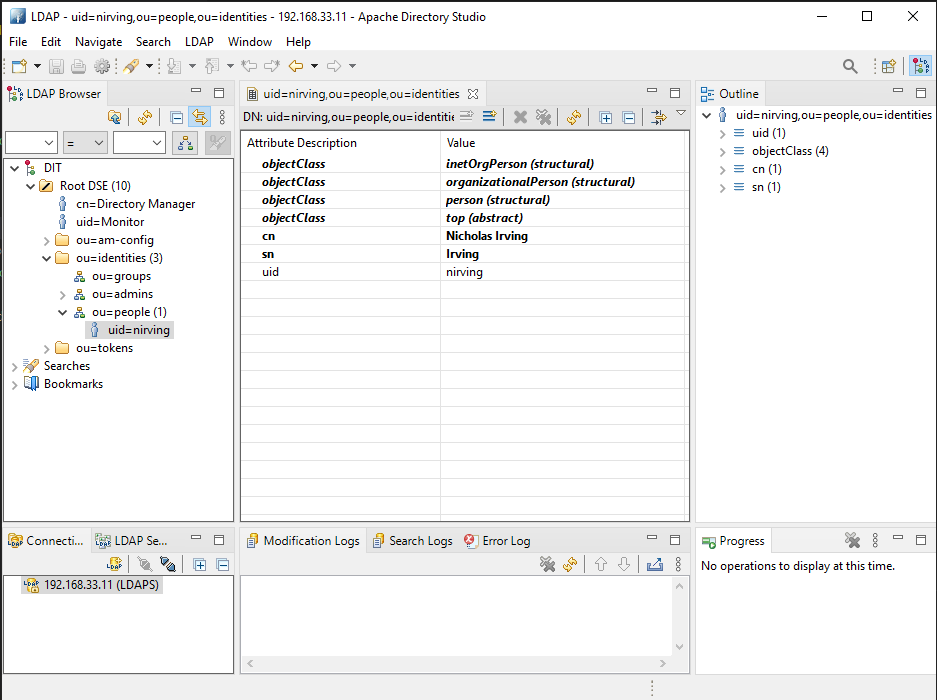

# Idempotent LDIF Import

Simple tool to a LDIF file to import into a directory server and ensure that it remains the same each time it is run.

## Build

```
go build .
```

## Usage

```bash
ldifimport . -config .\example\config.yml -ldif .\example\newEntry.ldif
```

## Configuration

| Command | Description | defult |
| --- | --- | --- |
| host| `host` to connect to either IP or FQDN|`localhost`|
| port| `port` to connect to| `389`|
| bindDN| `bind dn` to use | `cn=Directory Manager`|
| bindPassword| `bind password` to use | `Passw0rd` |
| usessl| Connection requires `ssl` | `false` |
| starttls|  Connection uses `starttls` |`false`| 

### Example

```
host: 192.168.33.11
port: 1636
bindDN: cn=Directory Manager
bindPassword: Passw0rd
usessl: true
```

## Result


